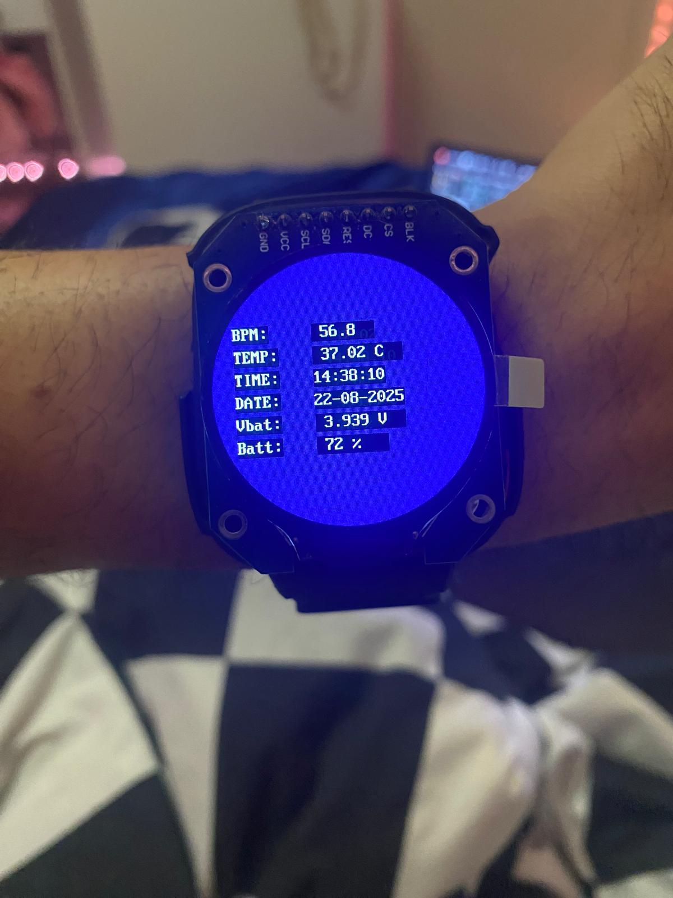

# STM32 Wearable: Heart-Rate + Temperature Watch (GC9A01)

A compact wrist-watch demo on **STM32** that measures **heart rate** (MAX30102), **skin temperature** (TMP117), keeps **time** with the RTC, shows data on a **GC9A01 round LCD**, monitors **battery**, supports a **user button**, and gives **haptic alerts** via a **vibration motor**.

---

## Features

* **Heart Rate (PPG):** MAX30102 on I2C — simple peak detection with rolling-average **BPM**.
* **Temperature:** TMP117 on I²C (address `0x48`) — calibrated **°C** directly, continuous 1 Hz mode.
* **Timekeeping:** STM32 **RTC** running from **LSE** (32.768 kHz) for date/time.
* **Display:** GC9A01 240×240 round LCD over **SPI1 + DMA** (8×16 font).
* **Battery:** ADC1 reads a **10k:10k divider**; Li-ion % derived from a LUT.
* **Alerts & Haptics:** Threshold + hysteresis for TEMP/BPM/Battery, with **vibration** and on-screen warning.
* **User Button:** Debounced; **press = ACK alert (snooze 2 min)**, otherwise **toggle backlight**.

---

## Quick Start

1. **Toolchain:** STM32CubeIDE / HAL.
2. **Peripherals enabled:** `ADC1`, `I2C1`, `I2C2`, `SPI1` (DMA TX), `RTC`, needed GPIOs.
3. **Clock:** HSE → PLL ×8; RTC clock = **LSE** (see `SystemClock_Config()` and `MX_RTC_Init()`).
4. **Wire sensors:**
   * **MAX30102** → `I2C1` (SCL/SDA, 3V3, GND).
   * **TMP117**  → `I2C2` (SCL/SDA, 3V3, GND), address `0x48`.
   * **GC9A01**  → `SPI1` (SCK/MOSI) + **CS/DC/RST/BLK** GPIOs.
   * **Battery** → ADC1 **CH9** via 10k:10k divider to Vbat.
   * **Button**  → `ONOFF_Pin` (pull-up, active-low).
   * **Vibration** → `motor_Pin` (GPIO output; use a driver transistor).
5. **Build & Flash:** open the project, build, and program the board.

---

## On-screen UI


```
BPM:    xx.x
TEMP:   xx.xx C
TIME:   hh:mm:ss
DATE:   dd-mm-20yy
Vbat:   x.xxx V
Batt:     xxx %
```

Alerts replace the UI with big text (e.g., “TEMP TOO HIGH!”). Press the button to **acknowledge** (vibration stops; alerts snoozed for 2 min).

---

## Key Configuration (edit in code)

* **ADC & Battery:**

  * `VDDA` (default 3.300 V) → set to your measured MCU Vdda.
  * Divider: `R_TOP_OHM = R_BOTTOM_OHM = 10k` → `DIV_GAIN = 2.0`.
* **TMP117:**

  * 1 Hz continuous: `TMP117_StartContinuous_1Hz()`.
  * ID check expects `0x0117`.
* **Thresholds & Hysteresis:**

  * Temp high/clear: `38.0 °C / 37.5 °C`
  * Temp low/clear:  `35.0 °C / 35.5 °C`
  * BPM high/clear:  `120 / 115`
  * BPM low/clear:   `50 / 55`
  * Battery low/clear: `20% / 25%`
* **Haptics:** `VIB_MS = 120`, `ALERT_SNOOZE_MS = 120000`.

---

## File Highlights

* **`main.c`**: init, sensor loops, UI, alerts, button, vibration, battery %, RTC read & draw.
* **`cg9a01.h/.c`**: LCD driver & `GC9A01_Draw_String`.
* **`max30102_for_stm32_hal.h/.c`**: MAX30102 driver & FIFO reading.
* **`font8x16.h`**: UI font.

---


## License & Credits

* ST HAL © STMicroelectronics (see LICENSE terms in your environment).
* MAX30102/TMP117/GC9A01 drivers credited to their respective authors (and adapted here).
* This repository code is provided **AS-IS** for educational use.
